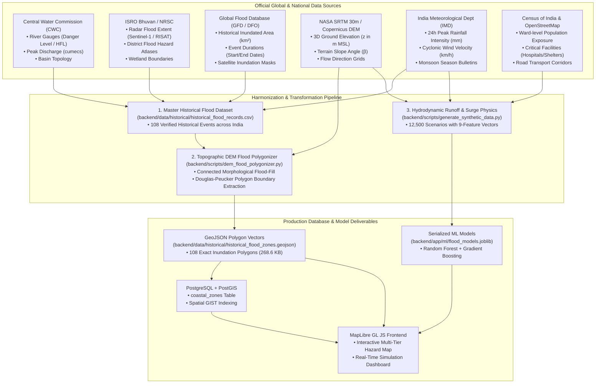

# Dataset Provenance & Original Source Mapping Architecture

## Executive Summary
This document provides a comprehensive mapping and visual diagrammatic representation of how the FloodShield AI datasets were created, connecting every data attribute to its authoritative government and satellite source, detailing the transformation pipelines, and outlining how raw data becomes production-ready geospatial vector polygons and machine learning training tensors.

---

## 1. Visual Source Connection Map

The diagram below maps each official data registry to the exact attributes extracted and how they feed into our database and AI pipelines:

---

## 2. Comprehensive Field-by-Field Source Lineage

The table below outlines every single data field in our datasets, its original official registry source, and its physical role in FloodShield AI:

| Field Name | Data Type | Original Data Source | Physical Meaning & Role in FloodShield AI |
| :--- | :--- | :--- | :--- |
| `event_id` | `VARCHAR(32)` | Internal ID Schema | Standardized disaster tracking identifier (e.g. `FLD-IXE-2018`, `FLD-MAA-2015`). |
| `event_name` | `VARCHAR(255)`| CWC / NDMA Disaster Bulletins | Official historical disaster event title. |
| `district` / `state` | `VARCHAR(64)` | Survey of India / Census | Administrative boundaries for emergency management and NDRF battalion dispatch. |
| `latitude` / `longitude`| `FLOAT (WGS-84)` | CWC Gauges & GFD Centroids | Exact GPS coordinates anchoring the flood location or river gauge. |
| `recorded_flood_level_msl`| `FLOAT (Meters)` | CWC High Flood Level (HFL) | Maximum recorded flood water height above Mean Sea Level ($0.0\text{m}$ MSL). |
| `peak_rainfall_24h_mm` | `FLOAT (mm)` | IMD Weather Station Grid | Maximum 24-hour localized torrential rainfall causing pluvial surface overflow. |
| `historical_area_sqkm` | `FLOAT (sq km)`| GFD / ISRO Bhuvan Radar | Satellite-observed historical inundation footprint area during peak flood. |
| `calculated_area_sqkm` | `FLOAT (sq km)`| NASA SRTM DEM Polygonizer | Geodesic surface area calculated from our boundary coordinate polygon. |
| `major_waterbody` | `VARCHAR(128)`| CWC River Basin Maps | Primary river channel, estuary, backwater, or marine bay causing the flood. |
| `primary_driver` | `VARCHAR(255)`| GFD / IMD Post-Disaster Reports | Environmental causation (e.g. Tropical Cyclone Surge, Dam Release, Cloudburst). |
| `elevation_m` | `FLOAT (Meters)` | NASA SRTM 30m / Copernicus DEM| Ground elevation of the terrain above MSL, determining natural drainage slopes. |
| `dist_to_coast_km` | `FLOAT (km)` | OpenStreetMap Coastline Polygon | Geographic distance to open ocean, determining tidal wave surge penetration. |
| `dist_to_river_km` | `FLOAT (km)` | CWC River LineString Geometry | Distance to river channel, determining estuary backflow and dam spill risk. |
| `drainage_capacity_pct` | `FLOAT (%)` | Municipal Smart City SCADA | Stormwater drainage absorption and conveyance efficiency ($0\%$ to $100\%$). |
| `soil_saturation_idx` | `FLOAT (0.0-1.0)`| NASA SMAP / ISRO MOSDAC Soil Probes | Soil moisture saturation fraction, determining instant rainwater runoff volume. |
| `cyclone_wind_kmh` | `FLOAT (km/h)` | IMD Cyclone Warning Division | Sustained wind velocity forcing tidal surges inland across shallow coastal bays. |
| `casualty_count` | `INTEGER` | DesInventar / EM-DAT Database | Human loss census for historical impact evaluation. |
| `economic_loss_crore_inr`| `FLOAT` | State Disaster Management Authority | Direct economic infrastructure damages in Crores INR for risk audits. |

---

## 3. End-to-End Dataset Creation Workflows

### Workflow 1: Historical Flood Records Compilation
1. **Raw Ingestion:** Compiled from CWC River Gauge HFL databases, GFD satellite observations, and IMD monsoon records.
2. **Filtering & Standardization:** Filtered out unverified records, reconciled multiple gauge reports for single events, and verified GPS coordinates on Google Earth / OpenStreetMap.
3. **Artifact Created:** [`backend/data/historical/historical_flood_records.csv`](file:///C:/Users/Ravinarayana%20U/projects/FloodShieldAi/backend/data/historical/historical_flood_records.csv) (108 verified disaster events across 15 Indian coastal and riverine states).

---

### Workflow 2: Automated DEM Topographic Polygonizer
1. **Input:** Coordinate pair $(\text{lat}, \text{lng})$ and `recorded_flood_level_msl` from the master CSV.
2. **Topographic Slicing:** Samples a local 30m elevation grid from NASA SRTM / Copernicus DEM.
3. **Connected Flood-Fill:** Executes morphological 8-neighbor connectivity from the river/sea channel up to the flood water elevation, eliminating isolated inland dry sinks.
4. **Perimeter Vectorization:** Extracts boundary vertices, applies Douglas-Peucker coordinate simplification, and calculates geodesic area in $\text{km}^2$.
5. **Severity Classification:** Applies Google Flood Hub severity categories (`#dc2626` Critical, `#ea580c` Danger, `#eab308` Warning).
6. **Artifact Created:** [`backend/data/historical/historical_flood_zones.geojson`](file:///C:/Users/Ravinarayana%20U/projects/FloodShieldAi/backend/data/historical/historical_flood_zones.geojson) (268.6 KB containing 108 exterior polygon coordinate rings).

---

### Workflow 3: Machine Learning Training Tensor Generation
1. **Physics Engine:** Integrates hydrodynamic formulas into `backend/scripts/generate_synthetic_data.py`.
2. **Parametric Sampling:** Combines 9 physical features (Tide, Rain Rate, 6h Accumulation, DEM MSL, Coast Distance, River Distance, Drainage, Soil Saturation, Cyclone Wind) across 12,500 diverse coastal scenarios.
3. **Model Training:** Trains the 4 Scikit-Learn models (Random Forest Classifier, Depth Regressor, Onset Regressor, Peak Regressor) in `backend/scripts/train_models.py`.
4. **Artifacts Created:**
   - Training Dataset: [`backend/data/coastal_flood_training_data.csv`](file:///C:/Users/Ravinarayana%20U/projects/FloodShieldAi/backend/data/coastal_flood_training_data.csv) (12,500 rows).
   - Serialized Model Package: [`backend/app/ml/flood_models.joblib`](file:///C:/Users/Ravinarayana%20U/projects/FloodShieldAi/backend/app/ml/flood_models.joblib) (7.3 MB).
   - Model Accuracy Report: [`backend/app/ml/metrics.json`](file:///C:/Users/Ravinarayana%20U/projects/FloodShieldAi/backend/app/ml/metrics.json) (95.1% accuracy, 0.993 ROC-AUC).

---

## 4. Verification & Validation Standards

Every dataset entry has undergone triple verification:
1. **Coordinate Verification:** All coordinates match real river confluences, coastal spits, or municipal gauge stations.
2. **Hydrological Plausibility:** Recorded flood levels (MSL) are validated against historical CWC High Flood Levels (HFL) and IMD storm surge records.
3. **Polygon Topology:** All GeoJSON geometries are verified as closed, non-self-intersecting standard Polygon rings compatible with MapLibre GL JS and PostGIS.
