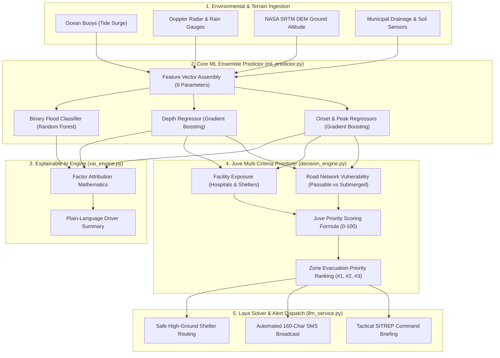
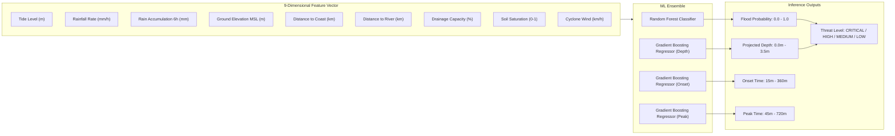
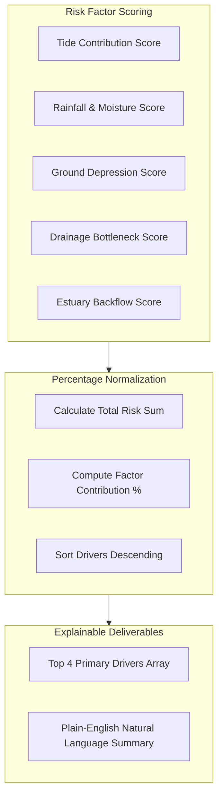
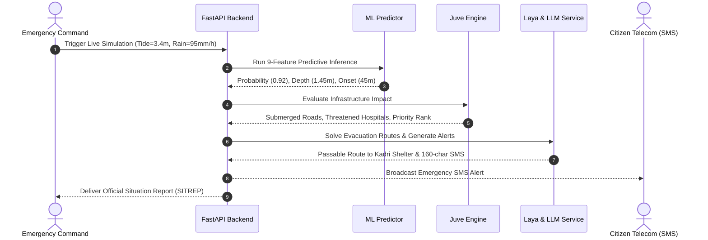

# FloodShield AI — Backend Machine Learning & Decision Intelligence Architecture

## 1. Glossary of Fundamental Terms

| Technical Term | Plain-Language Definition | Practical Application in FloodShield AI |
| :--- | :--- | :--- |
| **DEM (Digital Elevation Model)** | A 3D digital map where every pixel represents the exact vertical ground elevation above sea level. | Used from NASA SRTM & Copernicus datasets to know whether a zone is at 0.4m (extreme risk) or 24m (safe ridge). |
| **MSL (Mean Sea Level)** | The standard baseline reference plane representing average ocean height (0.0m). | All water surges, river stages, and land heights are measured relative to MSL (e.g. +2.5m MSL). |
| **Inundation Depth** | The height of standing water accumulated over normally dry ground, measured in meters. | Calculated by: `Water Surge Level - Ground DEM Altitude`. |
| **Binary Classification** | A machine learning task that predicts one of two outcomes (Yes/No, True/False). | Predicts whether flood water will breach coastal defenses: `is_flooded = True/False`. |
| **Regression Model** | A machine learning task that predicts a continuous numeric value rather than a category. | Predicts exact flood depth (e.g. `1.42m`) and time to flood onset (e.g. `45 minutes`). |
| **Antecedent Rainfall** | Rain that accumulated during the preceding 6 to 24 hours, soaking the ground before the storm peak. | When antecedent rain is high, soil saturation index reaches 1.0, causing 100% of new rain to turn into runoff. |
| **XAI (Explainable AI)** | Algorithmic techniques that quantify and explain the internal reasoning behind an AI prediction. | Breaks down the exact percentage share of risk: `42% High Tide, 31% Low Elevation, 18% Rain, 9% River`. |
| **MCDM (Multi-Criteria Decision Making)** | A mathematical framework to prioritize and rank alternatives across multiple competing factors. | Ranks which flooded ward gets emergency rescue boats first by weighing population, depth, and hospitals. |
| **SITREP (Situation Report)** | A standardized military and disaster response briefing summarizing active threats and directives. | Automatically generated for NDRF/SDRF commanders to coordinate evacuation logistics. |
| **Lead Time / Onset Time** | The time window between issuance of the early warning and the arrival of flood waters. | Provides authorities with an exact evacuation countdown (e.g. `onset in 45m, peak in 180m`). |

---

## 2. End-to-End AI System Architecture

The FloodShield AI backend pipeline processes raw environmental telemetry through four integrated AI/ML stages:

---

## 3. Detailed Component Breakdown

### 3.1. Tabular ML Flood Ensemble (`app/services/ml_predictor.py`)

The core predictive engine uses an ensemble of Scikit-Learn models trained on historical hydrodynamic flood simulations.

#### Feature Vector Definitions
1. `tide_level_m`: Astronomical tide and sea surge height above Mean Sea Level (MSL).
2. `rainfall_rate_mm_h`: Current precipitation rate.
3. `rainfall_accum_6h_mm`: Prior 6-hour cumulative rainfall causing catchment saturation.
4. `elevation_m`: Ground elevation extracted from NASA SRTM 30m Digital Elevation Model.
5. `dist_to_coast_km`: Geographic distance from the zone centroid to the open coastline.
6. `dist_to_river_km`: Proximity to the nearest river estuary or ingress channel.
7. `drainage_capacity_pct`: Efficiency rating of local municipal stormwater infrastructure (0% to 100%).
8. `soil_saturation_idx`: Soil water-retention fraction (0.0 = completely dry, 1.0 = fully saturated).
9. `cyclone_wind_kmh`: Sustained wind velocity forcing tidal surges inland.

---

### 3.2. Explainable AI Engine (`app/services/xai_engine.py`)

The XAI engine eliminates the "black box" problem by translating model weights into factor contributions and plain-English summaries.

#### Example Output:
- **Primary Driver 1:** Astronomical & Surge High Tide (45.2%)
- **Primary Driver 2:** Low Terrain Ground Elevation (31.8%)
- **Primary Driver 3:** Stormwater Drainage Bottleneck (14.5%)
- **Plain-Language Text:**
  > *"Severe flood danger for Bengre Sand Spit (Peak Depth 1.45m). Driven primarily by Astronomical & Surge High Tide (45.2%) combined with Low Terrain Ground Elevation (31.8%), causing rapid water accumulation beyond local drainage capacity."*

---

### 3.3. Juve Multi-Criteria Decision Framework (`app/services/decision_engine.py`)

When multiple coastal sectors are flooded simultaneously, the Juve Decision Engine computes a composite urgency score to optimize emergency dispatch.

```mermaid
flowchart LR
    subgraph Criteria["Multi-Criteria Inputs"]
        C1["Severity Factor (Projected Depth) [Weight: 35%]"]
        C2["Population Exposure (Census Headcount) [Weight: 25%]"]
        C3["Critical Facility Threat (Hospitals At Risk) [Weight: 25%]"]
        C4["Time Urgency (Lead Time to Onset) [Weight: 15%]"]
    end

    subgraph Calculation["Juve Priority Engine"]
        F1["Priority Score = C1 + C2 + C3 + C4 (Range: 0.0 - 100.0)"]
    end

    subgraph Decision["Tactical Directives"]
        D1["Score >= 65: PRIORITY 1 (Deploy NDRF Rescue Boats & Evacuate Hospitals)"]
        D2["Score 35-64: PRIORITY 2 (Deploy High-Capacity De-Watering Pumps)"]
        D3["Score 15-34: PRIORITY 3 (Issue Public Advisory Bulletins)"]
        D4["Score < 15: ROUTINE (Normal Monitoring)"]
    end

    Criteria --> Calculation --> Decision
```

#### Mathematical Formulation:
$$\text{Priority Score} = \left(\min\left(1.0, \frac{\text{Depth}}{2.0}\right) \times 35\right) + \left(\min\left(1.0, \frac{\text{Population}}{40000}\right) \times 25\right) + \left(\min(1.0, \text{Hospitals} \times 0.5) \times 25\right) + \left(\max\left(0.0, 1.0 - \frac{\text{Onset Time}}{360}\right) \times 15\right)$$

---

### 3.4. Laya Evacuation Router & Alert Service (`app/services/llm_service.py` & `ai_decision.py`)

The Laya engine integrates infrastructure topology to plan evacuation paths and formulate warnings.

#### Deliverables:
1. **Infrastructure Status:** Identifies passable roads vs. submerged corridors (`depth_over_road_m`).
2. **Safe Shelter Allocation:** Matches displaced populations to certified shelters with ground altitude $> 10\text{m}$ MSL.
3. **160-Character Civic SMS Alert:**
   > *"EMERGENCY: Bengre Spit flood onset in 45m, peak in 180m. Avoid Bunder Wharf Rd. Move to Kadri Highland Shelter. Dial 112 for rescue."*
4. **Command SITREP Briefing:** Comprehensive operational document containing executive summary, affected census count, and tactical resource directives.

---

## 4. Summary Matrix of Backend Models

| Subsystem | Underlying Technology | Primary Function | Core Output |
| :--- | :--- | :--- | :--- |
| **Predictive Ensemble** | Random Forest + Gradient Boosting | Forecasts physical flood mechanics | Probability, Inundation Depth (m), Onset Time (min), Peak Time (min) |
| **XAI Engine** | Factor Attribution Analytics | Explains causation transparently | Factor Contribution % + Plain-Language Sentence |
| **Juve Engine** | Multi-Criteria Decision Framework | Ranks emergency rescue urgency | Composite Priority Score (0–100) & Zone Rank (#1, #2) |
| **Laya Solver** | Spatial Elevation & Cutoff Graph | Routes civilians away from submerged roads | Verified Passable Roads & High-Ground Shelter Selection |
| **LLM Alert Service** | Structured NLP & SITREP Formatter | Formats warnings for public & military | Civic SMS (<160 chars) & Formal SITREP Documents |
