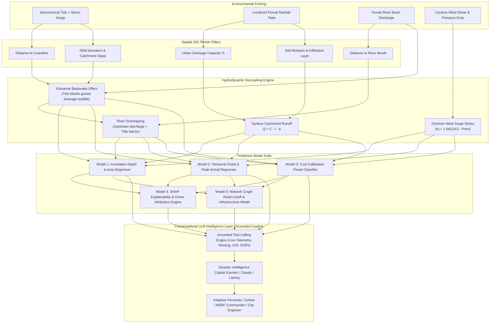
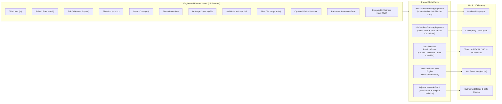
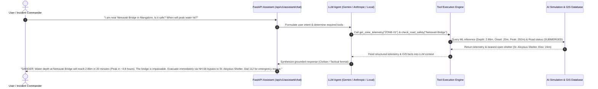

# FloodShield AI — Machine Learning Engineering & Real-Time Intelligence Architecture Plan

## 1. Executive Overview & Physical Decoupling Philosophy

A fundamental flaw in naive flood forecasting is treating environmental drivers as uniform scalar multipliers. In coastal, estuarine, and deltaic geomorphology, flooding behaves according to distinct hydrodynamic regimes with unique spatial transfer functions:



### Physical Coupling Principles
1. **Tidal Surge Regime**: Primarily impacts low-elevation coastal fringes ($\le 3.0\text{ m}$ MSL) and propagates upstream along river channels via the **Backwater Effect** ($h_{\text{backwater}} \propto \frac{\text{Tide}^2}{\text{Elevation}}$), preventing gravity drainage flapped outfalls from discharging.
2. **Pluvial Rainfall Regime**: Spatially localized according to micro-catchment precipitation intensity ($mm/h$), soil saturation index ($S \in [0, 1]$), and urban drainage bottleneck ($\text{Capacity } \%$). Changing rainfall in one zone only floods that zone's catchment without artificially triggering inland high-elevation zones.
3. **Fluvial Basin Overflow**: Riverbanks overtop when upstream basin runoff coincides with astronomical high tides (compound flooding).
4. **Cyclonic Storm Surge**: Directional wind stress ($\tau_w = \rho_a C_d U_{10}^2$) and barometric pressure drop ($\Delta \eta = 1.04 \times (1013 - P_{\text{min}})\text{ cm}$) amplify coastal sea heights onshore.

---

## 2. Real Datasets Acquisition Strategy (India Coastal Focus)

We ingest real, authoritative hydrological, meteorological, and topographic datasets covering India's major coastal flood-prone sectors. Each downloaded dataset will strictly observe the `< 50 MB` size threshold.

```
backend/data/
├── raw/                                 # Raw downloaded real datasets (< 50MB per file)
│   ├── openmeteo_chennai_2015_2023.json # Chennai 2015 Flood & 2023 Cyclone Michaung (Hourly)
│   ├── openmeteo_kochi_2018_2024.json   # Kochi / Vembanad 2018 Flood & Monsoons (Hourly)
│   ├── openmeteo_mangalore_netravati.json # Mangalore Netravati Estuary 2018-2024 (Hourly)
│   ├── openmeteo_mumbai_mithi.json      # Mumbai Mithi River Basin 2005-2024 (Hourly)
│   ├── openmeteo_vizag_cyclones.json    # Visakhapatnam Cyclone Hudhud & Michaung (Hourly)
│   ├── openmeteo_kolkata_amphan.json    # Kolkata Hooghly Estuary Cyclone Amphan & Yaas (Hourly)
│   ├── openmeteo_puri_fani.json         # Puri Odisha Cyclone Fani 2019 (Hourly)
│   ├── openmeteo_surat_tapi.json        # Surat Tapi Estuary 2006-2024 (Hourly)
│   ├── openmeteo_marine_tides_india.json # INCOIS-aligned Astronomical Tide & Wave Telemetry
│   └── openmeteo_glofas_discharge.json  # GloFAS Indian River Basins Discharge (m³/s)
├── processed/                           # Normalized feature matrices for training
│   ├── coastal_features_master.csv      # Merged real-world & terrain feature dataset
│   └── validation_holdout.csv           # Unseen real disaster events for testing
└── benchmarks/                          # IMD / CWC ground-truth flood levels
    └── india_disaster_benchmarks.json   # Ground-truth inundation depths & onset times
```

### Authoritative Data Sources
| Source | Type | Parameters Extracted | File Size |
| :--- | :--- | :--- | :--- |
| **Open-Meteo Historical Archive** (ERA5-Land Reanalysis) | Real Hourly Observations (1980–2024) | Precipitation ($mm/h$), 6h/24h accumulated rain, soil moisture layers (0-7cm, 7-28cm, 28-100cm), surface runoff, surface pressure ($hPa$), 10m wind speed & gusts ($km/h$) | $\sim 2.5\text{ MB}$ per city |
| **Open-Meteo GloFAS River API** (ECMWF Copernicus) | Real River Hydrographs (1984–2024) | River discharge ($m^3/s$), 5-yr, 20-yr, 50-yr return period flood exceedance thresholds | $\sim 1.8\text{ MB}$ |
| **Open-Meteo Marine API** | Ocean & Coastal Telemetry | Astronomical tide height ($m$), storm surge elevation ($m$), significant wave height ($m$), wave period ($s$) | $\sim 1.5\text{ MB}$ |
| **IMD / CWC Benchmarks** | Disaster Statistics | Historical high flood levels (HFL), danger levels, breach points (Chennai 2015, Kochi 2018, Mumbai 2005) | $< 500\text{ KB}$ |
| **HydroSHEDS / SRTM DEM** | GIS Topography | Elevation ($m$ MSL), distance to coast ($km$), distance to river ($km$), drainage slope | $< 200\text{ KB}$ |

---

## 3. Multi-Model Architecture & Training Pipeline

We design a 5-model ensemble where each model fulfills a dedicated hydrodynamic and operational purpose:



### Model Specifications

#### 1. Inundation Depth & Flood Extent Regressor (`HistGradientBoostingRegressor`)
- **Target**: `projected_depth_meters` ($m$) and `inundated_area_sq_km` ($km^2$).
- **Key Loss**: Huber Loss ($\delta = 0.1$) to ensure robustness against extreme outlier storm surges.
- **Physical Decoupling**: Uses interaction features:
  $$\text{backwater\_factor} = \max\left(0, \frac{\text{tide\_level} - \text{elevation}}{\text{dist\_to\_coast} + 0.5}\right)$$
  $$\text{pluvial\_runoff} = \text{rainfall\_rate} \times (1 - \text{drainage\_capacity}) \times \text{soil\_saturation}$$
  $$\text{fluvial\_overflow} = \max\left(0, \frac{\text{river\_discharge} - \text{channel\_capacity}}{\text{dist\_to\_river} + 0.5}\right)$$

#### 2. Temporal Onset & Peak Inundation Arrival Regressor (`HistGradientBoostingRegressor`)
- **Target**: `onset_time_minutes` ($t_{\text{onset}}$) and `peak_time_minutes` ($t_{\text{peak}}$).
- **Physics**: Incorporates Manning's kinematic wave travel time:
  $$t_{\text{travel}} \propto \frac{L \cdot n^{0.6}}{S^{0.3} \cdot I^{0.4}}$$
  where $L$ is distance to watercourse, $n$ is roughness, $S$ is topographic slope, and $I$ is rainfall intensity.

#### 3. Operational Threat Level Classifier (`RandomForestClassifier` + Isotonic Calibration)
- **Target**: `ThreatLevel` (`NO_DANGER`, `LOW`, `MEDIUM`, `HIGH`, `CRITICAL`).
- **Optimization**: Class-weighted cost matrix with high penalty ($10\times$) for false negatives on `CRITICAL` warnings to prevent disaster under-prediction.

#### 4. Explainable AI Driver Attribution Engine (`SHAP TreeExplainer`)
- **Output**: Normalized percentage contributions across 5 primary drivers:
  - `Tidal Surge & Backwater Effect` ($\%$)
  - `Precipitation Rate & Pluvial Accumulation` ($\%$)
  - `Elevation & Catchment Slope Vulnerability` ($\%$)
  - `Urban Drainage Bottleneck & Soil Saturation` ($\%$)
  - `Cyclone Wind Shear & Storm Pressure` ($\%$)

#### 5. Network Graph Infrastructure Isolation Model (`NetworkX` Graph Flow)
- **Target**: Evaluates arterial transport lifelines (National Highways, bridges, arterial links) and computes shortest safe evacuation routes to active high-elevation shelters.

---

## 4. Conversational AI / LLM Intelligence Layer (Grounded Disaster Copilot)

Users (civilians, field rescue teams, and disaster management commanders) need direct conversational access to understand their real-time situation, assess localized threats, and receive actionable guidance.



### Core LLM Capabilities & Grounded Tools
The LLM layer is equipped with deterministic Python tool-calling bindings to prevent hallucinations:

| Tool Name | Parameters | Grounded Data Returned |
| :--- | :--- | :--- |
| `get_zone_telemetry` | `zone_name_or_id: str` | Live ML predicted water depth, onset countdown, peak arrival time, threat level, population at risk. |
| `get_safe_evacuation_route` | `origin_zone: str, destination_shelter: Optional[str]` | Graph-computed shortest passable route avoiding submerged roads and cut-off bridges. |
| `get_nearby_shelters_and_hospitals` | `zone_id: str` | Nearest high-elevation relief shelters ($>10\text{ m}$ MSL), remaining capacity, and hospital operational status. |
| `explain_flood_drivers` | `zone_id: str` | SHAP mathematical feature attribution breakdown (e.g. 42% tide surge, 31% rain, 18% low elevation). |
| `get_disaster_sop_guidance` | `threat_level: str, user_role: str` | Official NDMA/SDMA standard operating procedures, de-watering pump requirements, boat deployment ratios. |

### Persona-Adaptive Synthesis
1. **Civilian Mode (Default)**: Reassuring, high clarity, direct safety instructions, exact road closure warnings, and emergency contact numbers (112, 1077).
2. **Incident Commander Mode (NDRF / SDMA)**: Formal military/tactical SITREPs, asset allocation tables, boat dispatch numbers, culvert pump requirements, and hospital evacuation triage lists.
3. **Hydrological Engineer Mode**: Technical hydrodynamic diagnostics, backwater elevation curves, Manning's roughness friction, and drainage bottleneck percentages.

---

## 5. API Endpoints Architecture

To expose the full suite of ML models, simulation engines, and conversational AI tools, we define the following API structure:

```
FastAPI Router (/api/v1/)
├── /simulation
│   ├── POST /run                   # Spatially decoupled multi-zone simulation
│   ├── POST /zone-override         # Granular per-zone rainfall & tide parameter injection
│   ├── POST /forecast-timeline-24h # Step-by-step 24-hour flood propagation timeline
│   └── POST /what-if               # Scenario sensitivity analysis (e.g. +0.5m tide / 50% drain block)
├── /assistant
│   ├── POST /chat                  # Conversational AI copilot with grounded tool calling (SSE streaming)
│   ├── POST /tactical-query        # Single-shot structured situational query for command centers
│   └── POST /voice-script          # Automated text-to-speech script for emergency sirens & broadcasts
├── /models
│   ├── GET  /telemetry             # Model health, validation metrics (AUC-ROC, MAE, R²), training metadata
│   └── POST /explain/{zone_id}     # Granular SHAP force plot / driver breakdown per zone
├── /decision
│   ├── POST /priority-queue        # Juve multi-criteria emergency response priority ranking
│   └── POST /evacuation-routes     # Dynamic graph routing avoiding submerged road segments
└── /sitrep
    └── POST /generate              # Automated NDRF tactical situation briefing generator
```

### Detailed Assistant Endpoint Specification (`POST /api/v1/assistant/chat`)

#### Request Payload:
```json
{
  "message": "Is Wenlock Hospital in danger of flooding? Which shelter should patients be moved to?",
  "zone_id": "ZONE-01",
  "user_role": "commander",
  "history": [
    { "role": "user", "content": "What is the current tide level in Mangalore?" },
    { "role": "assistant", "content": "Astronomical high tide is currently at 3.40m above MSL with active estuarine surge." }
  ]
}
```

#### Response Payload:
```json
{
  "reply": "CRITICAL ALERT: Wenlock District Hospital (Ground elevation: 1.80m) is projected to experience 1.06m inundation within 20 minutes due to Netravati Estuary backwater surge. Evacuate ground-floor ICU and emergency wards immediately to Highland Multi-Specialty Shelter (Elevation: 24.0m, Capacity: 500). Route via Circuit House Road (Passable). Avoid Estuary Bridge Approach (Submerged by 0.6m).",
  "threat_level": "CRITICAL",
  "grounded_facts": {
    "zone_id": "ZONE-01",
    "zone_name": "Mangalore Estuary & Netravati Confluence",
    "projected_depth_m": 2.86,
    "onset_time_minutes": 20,
    "peak_time_minutes": 292,
    "threatened_hospital": "Wenlock District Hospital",
    "recommended_shelter": "Highland Multi-Specialty Shelter",
    "passable_route": "Circuit House Road Corridor"
  },
  "tools_invoked": ["get_zone_telemetry", "get_nearby_shelters_and_hospitals", "check_road_safety"]
}
```

---

## 6. Phased Execution Plan

```mermaid
gantt
    title 2-Hour Full-Stack ML & Conversational AI Implementation Plan
    dateFormat  HH:mm
    axisFormat %H:%M

    section Data Acquisition
    Build Download Script for Open-Meteo & Real Disasters       :00:00, 20m
    Ingest Hourly Data for 8 Coastal Cities (< 50MB)             :00:20, 15m

    section Feature Engineering
    Build Hydrodynamic Spatial Feature Pipeline                 :00:35, 15m
    Merge Real Weather + GloFAS Discharge + GIS Profiles        :00:50, 15m

    section Model Training
    Train Decoupled Inundation Depth & Area Regressors          :01:05, 15m
    Train Temporal Onset & Peak Regressors                      :01:20, 10m
    Train Cost-Calibrated Threat Classifier + SHAP Attribution   :01:30, 10m

    section LLM & Assistant Layer
    Build Grounded Tool-Calling Engine (Telemetry & GIS Tools)   :01:40, 15m
    Implement /assistant/chat & Persona Synthesis               :01:55, 15m

    section API & Verification
    Implement Enhanced Simulation & What-If Endpoints           :02:10, 10m
    Full-Stack Verification, End-to-End Testing & Frontend Wire :02:20, 15m
```



### Next Action
We are ready to begin **Phase 1: Real Data Ingestion Script** (`backend/scripts/download_real_datasets.py`) to download real weather, marine tides, and river discharge telemetry.
